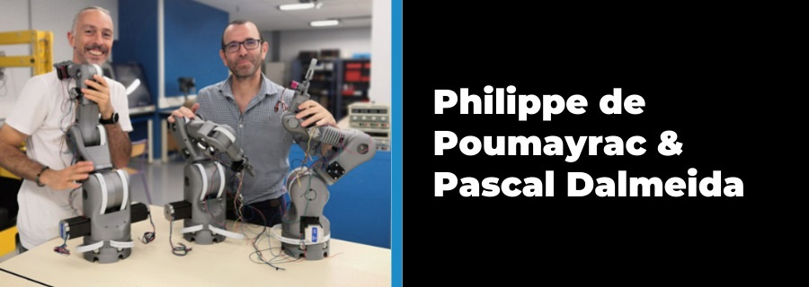
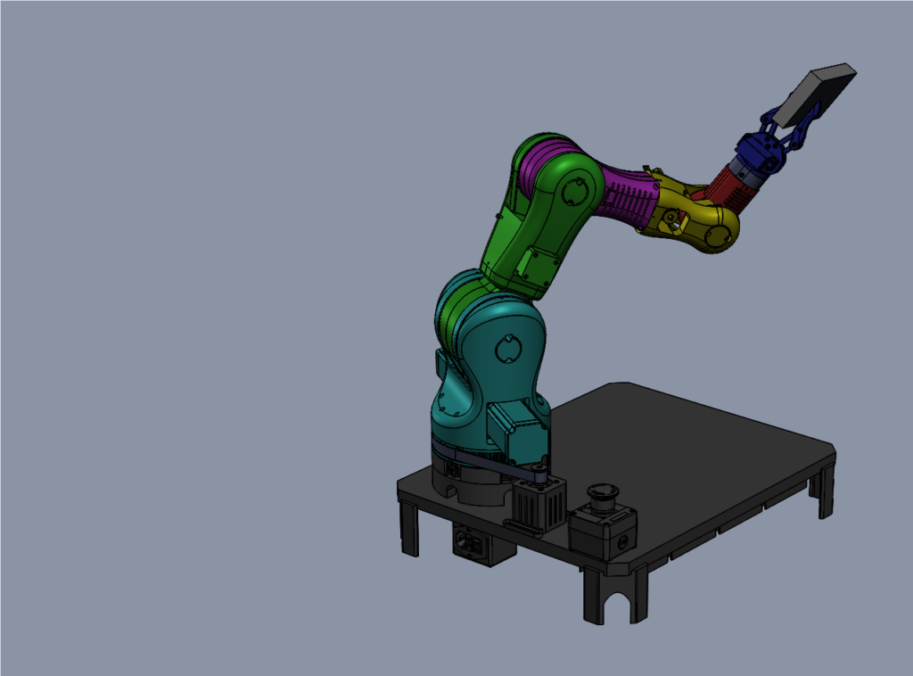

# Bras robotique 6 axes imprimé

[{.center}](https://www.bcn3d.com/ecole-des-mines-dales-3d-printed-6-axis-robot-arm/){target=_blank}

Nous sommes deux professeurs qui enseignons les Sciences Industrielles de l'Ingénieur depuis environ 20 ans. Après quelques années en région parisienne, nous avons atterri dans l'académie de Montpellier, au lycée Albert Einstein de Bagnols-sur-Cèze. Depuis octobre 2017, nous enseignons également la Robotique à l' [Ecole des Mines d'Alès](https://www.imt-mines-ales.fr/){target=_blank} aux futurs ingénieurs en Mécatronique.

## Pour nos élèves
A notre arrivée à l'Ecole des Mines d'Alès, nous avons été dotés de deux bras robotiques industriels 6 axes de type UR5 (Universal Robots) pour assurer nos travaux pratiques en Robotique. 

Après l'émerveillement d'un si gros investissement, nous avons constaté assez vite que nos élèves ingénieurs s'ennuyaient ! Après quelques heures d'utilisation, les élèves se sont rendus compte qu'ils ne pouvaient pas modifier la commande de ces bras industriels et tester ainsi le résultat de leurs calculs.

La principale réflexion qui nous passait par la tête était : « Comment mettre la pratique au cœur de l'enseignement de la robotique alors que le coût d'acquisition d'un bras industriel est de plusieurs dizaines de milliers d'euros ? ». Et donc, en 2018, nous avons alors pris la décision de concevoir notre propre bras articulé et sa commande. 

maîtriser entièrement la partie mécanique et la partie commande de notre bras pour les faire évoluer en fonction des besoins des utilisateurs : nos élèves. 
Nous nous sommes appuyés sur [le bras open source MOVEO de BCN3D](https://www.bcn3d.com/bcn3d-moveo-the-future-of-learning-robotic-arm/){target=_blank}  pour développer notre bras.

## Se lancer dans l'impression 3D
La création du bras a été rendue possible grâce à l'impression 3D. D'abord avec l'utilisation d'un logiciel de CAO, qui nous a semblé une évidence ! Cela nous a permis de rendre le bras très modulable et adaptable au besoin et de le faire évoluer en fonction des contraintes techniques et des retours des utilisateurs.

{.center}

Pour permettre à nos élèves de travailler de manière pratique et concrète sur un bras robotisé, il fallait multiplier ces bras et accepter le risque de casse. L'impression 3D était la solution évidente !

L'impression 3D (FDM) nous a permis de réaliser facilement et rapidement un prototype et de valider la faisabilité de ce projet. 

Nous souhaitons que la fabrication du bras soit accessible à tous. L'utilisation du PLA limite fortement le coût de la matière (moins de 25 €/kg) et le prix d'achat de l'imprimante 3D (à partir de 200 €).

Aussi, le coût de fabrication réduit de ce bras permet l'achat de plusieurs bras pour un faible coût et permet à nos élèves d'avoir facilement à leur disposition un bras articulé 6 axes et sa commande.

## Fonctionnement du bras
L'utilisation de [Scilab](https://www.scilab.org/){target=_blank} pour contrôler les six articulations de notre bras permet à chaque utilisateur d'avoir accès au contrôle du bras dans un environnement de calcul simple et entièrement programmable. Scilab, l'équivalent libre et open source de Matlab, est distribué sous licence GNU GPL.

<figure>
<iframe width="560" height="315" src="https://www.youtube-nocookie.com/embed/0IuvasmCI30" title="YouTube video player" frameborder="0" allow="accelerometer; autoplay; clipboard-write; encrypted-media; gyroscope; picture-in-picture" allowfullscreen></iframe>
</figure>

Afin d'aller vers un développement plus durable, nous avons choisi de nous fournir en filament pour impression 3D chez un fabricant Français [Francofil](https://francofil.fr/){target=_blank}.

## Aujourd'hui
En 2022, le proviseur du Lycée A. Einstein, M. Feutry, nous a confié la réalisation de la première série de quatre bras pour les mettre à disposition des différentes sections d'enseignement du lycée technique et professionnel.

Après l'achat par l'école des Mines d'Alès d'une première série de bras, chaque élève ingénieur peut travailler de manière pratique sur un bras robotisé. Les futurs ingénieurs peuvent ainsi tester concrètement leurs calculs et voir immédiatement l’effet de leurs modifications sur le comportement du bras.

Nous avons établi des partenariats avec d'autres écoles, pour fournir le bras robotisé à un prix coûtant. En échange, les lycées testent le bras avec leurs élèves et nous font part de leurs retours.

Notre objectif, à terme, est de proposer ce bras en open-source pour permettre à chaque élève ou étudiant et à chaque enseignant de fabriquer son propre bras.   

{.center}

## Demain
Dès le début de ce projet, mêlant mécatronique et impression 3D, nous avons eu la certitude que ce projet pouvait mettre la pratique au cœur de l’enseignement de la Robotique quel que soit l'âge et le niveau des élèves.

Nous recherchons donc des partenaires pour contribuer à l'évolution de ce bras et développer des activités autour de ce bras.

nous souhaitons rendre la Robotique accessible à tous.
- Abordable par son faible coût d'acquisition !
- Modulable par l'utilisation de l'impression 3D et d'une commande ouverte et paramétrable !

Lien pour lire l'article original en Anglais : [BCN3D » Changemakers » Ecole des Mines d’Alès’ 3D printed 6-axis robot arm](https://www.bcn3d.com/ecole-des-mines-dales-3d-printed-6-axis-robot-arm/){target=_blank}

<!-- Ceci est la future page d'accueil du site présentant le projet de développement d'un bras articulé 6 axes imprimé en 3D et de sa commande...

Ce site est généré automatiquement par GitHub Action avec le framework MkDocs et le thème Material. -->

